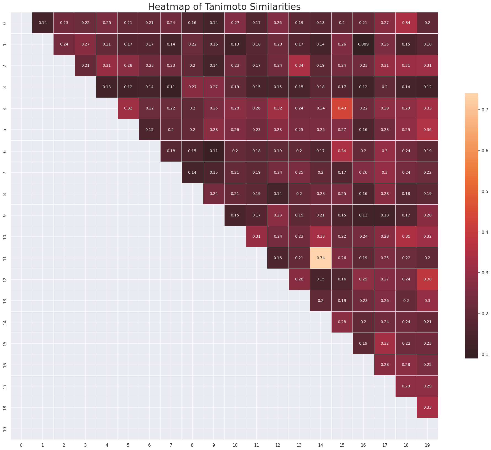

# Tanimoto_similarity
Calculate Tanimoto coefficient using different type of molecular fingerprints
$$T _{c}(A,B) = \frac{c}{a+b-c}$$

- a: number of features present in molecule A 
- b: number of features present in molecule B 
- c: number of features shared by molecules A and B

## Other resources
- For non-coding users, please visit this website to use: https://huggingface.co/spaces/MedAILab/TanimotoSimilarities
- To use on Google Colab: [](https://colab.research.google.com/github/tieulongphan8995/Tanimoto_similarity/blob/main/Tanimito_similarity.ipynb)

## Requirements
This module requires the following modules:

- [RDkit](https://www.rdkit.org/)

## Installation
Clone this repository to use

## Folder segmentation

Finally the folder structure should look like this:

    Tanimoto_similarity (project root)
    |__  README.md
    |__  similarities.py
    |__  test_smiles.smi
    |__  Image
    |__  LICENSE    
    |......

Example
  ```python
    import pandas as pd
    from similarities import tanimoto_similarity

    # 1. Load data
    smi = pd.read_csv('test_smiles.smi', header = None, sep="\t")
    smiles_list=smi.iloc[:,0].tolist() #convert dataframe to smiles list

    # 2. Call class tanimoto_similarity
    simi = tanimoto_similarity(smiles_list = smiles_list, fps ='ecfp2')

    # 3. Visualize triangle similarity matrix
    triangle_heatmap = simi.visualize_triangle()
    display(triangle_heatmap)

    # 4. Visualize two molecules having best similarity
    pair_visualize = simi.pair_best_similarity()
    display(pair_visualize)
```
## Result triangle heatmap 


## Result best similarity

